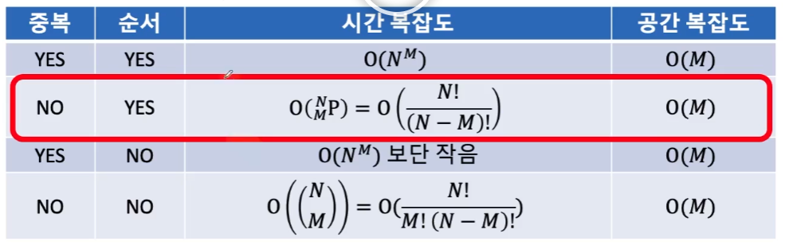

# coding-test

## 코딩 테스트 중요 팁

### 좋은 습관
1. 문제를 올바른 순서로 이해한다.
    - 읽기(시간, 메모리 제한 / 문제 전체를 꼼꼼히)
    - 이해하기(제공되는 정보[변수들] 정리 / 예제 데이터에 대해 이해)
    - 파악하기(가능한 최대, 최소 정답에 맞는 데이터를 직접 생성 / 키워드가 되는 단어들을 체크)
2. 시간과 공간 복잡도를 계산한다.

| 알고리즘              | 시간 복잡도              | 공간 복잡도 |
|---------------------|-------------------------|--------|
| BFS & DFS(w/인접 리스트) | O(V+E)                  | O(V+E) |
| Dijkstra            | O(ElogE) or O(ElogV)    | O(V+E) |
| Quick Sort          | 평균:O(NlogN) / 최악:O(N^2) | O(V)   |
| Binary Search       | O(NlogN)                | O(N)   |

3. 코드를 효율적으로 함수화해서 구현한다.
4. 코딩 테스트에서 부분 점수를 챙긴다.

### 완전 탐색

### 정렬
1. 시간 복잡도 약 O(N log N)
 - Primitive 원소정렬
 >  - Dual-Pivot Quick Sort
 >  - 최선 O(N)
 >  - 최악 O(N^2)
 >  - 평균 O(N log N)
 >  - In-place >> 정렬하는 과정에서 N에 비해 충분히 무시할 만한 개수의 메모리만큼만 추가적으로 사용하나?
 - Object 원소정렬
 >  - TimeSort
 >  - 최선 O(N)
 >  - 최악 O(N log N)
 >  - 평균 O(N log N)
 >  - Stable >> 동등한 위상의 원소들의 순서 관계가 보존되나?
 2. 정렬 알고리즘이 In-place(제자리) 한가? / 정렬 알고리즘이 Stable(안정) 한가?